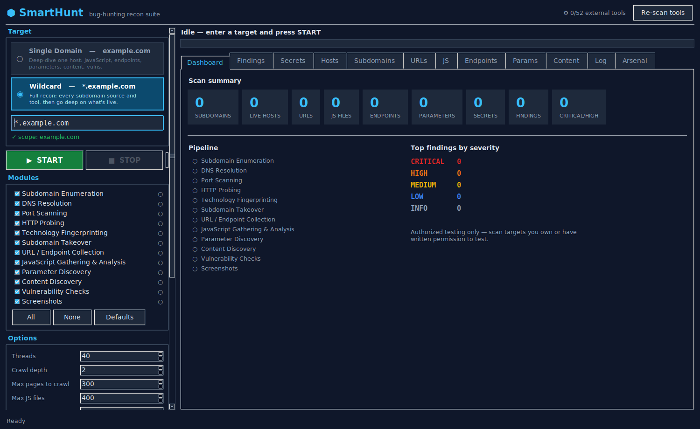
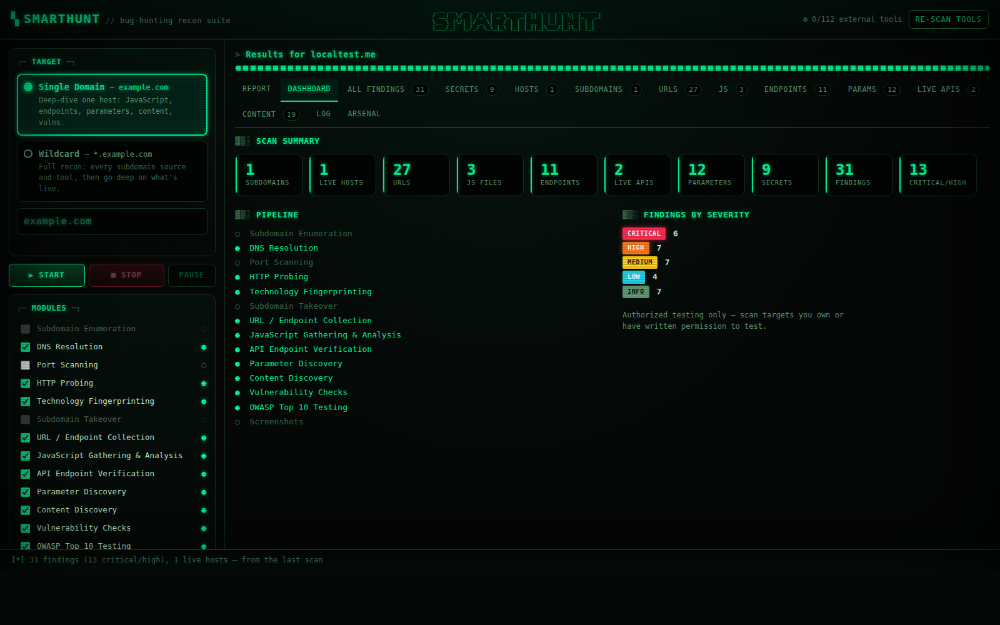
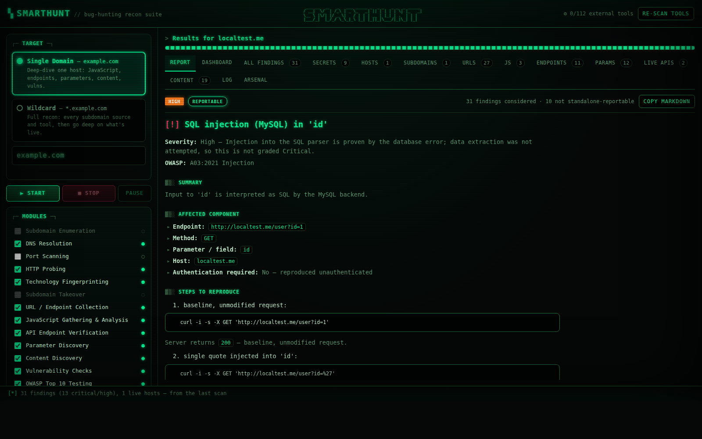

# SmartHunt

A GUI bug-hunting recon suite. Point it at a domain, press **START**, and it runs a
full reconnaissance pipeline — subdomain enumeration, HTTP probing, JavaScript
gathering, endpoint and parameter discovery, secret hunting, content discovery and
vulnerability checks — then hands you sortable results and an exportable report.



---

## Two target modes

The target box gives you exactly two options, and they run different pipelines:

| Mode | Input | What it does |
|---|---|---|
| **Single Domain** | `example.com` | Deep-dive one host. Crawls it, pulls **every JavaScript file** it can reach, mines those files for endpoints, parameters and hardcoded secrets, then discovers content and tests what it found. |
| **Wildcard** | `*.example.com` | Goes wide first. Runs **every** subdomain source and tool available, resolves them, probes for live web services, port-scans, checks for subdomain takeover — then runs the full deep-dive on everything that came back alive. |

Typing `*.example.com` into the box switches to wildcard mode automatically.

---

## Quick start

```bash
git clone <this repo>
cd SmartHunt
pip install -r requirements.txt      # just `requests`
python smarthunt.py                  # launch the desktop GUI
```

That's it. **No external tools are required** — SmartHunt ships pure-Python
implementations of every stage. Installing the optional tools below makes it
faster and deeper, but it produces real results out of the box. The arsenal
covers **112 tools across 20 categories** — see `install-tools.sh`.

### Browser mode

Prefer a browser, or hunting from a VPS over SSH? Run the same engine behind a
local web UI:

```bash
python smarthunt.py --web            # then open http://127.0.0.1:8777
python smarthunt.py --web --open     # …and launch your browser for you
python smarthunt.py --web --port 9000
```



The web UI is feature-identical to the desktop app — same two target modes, same
modules, live log, sortable/filterable result tables and the same exports. It
needs no extra dependency (it runs on Python's built-in `http.server`).

Because it lives on an origin every page in your browser can reach, it defends
itself on three fronts: `Host` must be a loopback name (blocking DNS rebinding),
every mutating request must carry a per-process `X-SmartHunt-Token` stamped into
the page, and a cross-origin `Origin` is rejected. Without that token check, any
site you happened to be visiting could quietly start scans from your machine.

If you're on a remote box, don't expose the port — forward it instead:

```bash
ssh -L 8777:127.0.0.1:8777 you@your-vps    # then browse http://127.0.0.1:8777
```

### Desktop mode

If Tkinter is missing:

```bash
sudo apt install python3-tk       # Debian / Ubuntu
sudo dnf install python3-tkinter  # Fedora / RHEL
brew install python-tk            # macOS
```

### Other ways to launch

```bash
python smarthunt.py example.com               # GUI with the target pre-filled
python smarthunt.py --tools                   # show which external tools were found
python smarthunt.py --cli example.com         # headless, same engine
python smarthunt.py --cli '*.example.com' --all --out results/
python -m smarthunt                           # GUI via the package
```

---

## One reportable bug, not a wall of noise

Most scanners hand you 30 findings and let you work out which one a triager will
accept. SmartHunt does that part for you: every scan ends in a **triage stage**
that applies an evidence gate to the whole finding set and produces exactly one
of three outputs.



| Outcome | When | What you get |
|---|---|---|
| **Report** | Every evidence field is filled and the behaviour reproduces | One finding, severity graded from proven impact, raw request/response, numbered `curl` steps, remediation |
| **Evidence needed** | Something looks real but a proof is missing | The exact tests still owed — never a half-written report |
| **Nothing reportable** | No candidate clears the gate | "No reportable vulnerability found with the current evidence." |

Two rules do the heavy lifting:

**A large class of scanner output is never a standalone report.** Missing
headers, version banners, `x-powered-by`, exposed Swagger, wildcard CORS,
directory listings, SSRF candidates without a collaborator callback, endpoint
discovery — all filtered out, each with the reason logged so you can see the
call being made.

**Severity comes from what was proven, not from the bug class.** Error-based SQL
injection proves injection, not data exfiltration, so it is graded High rather
than Critical, and the report says exactly why. Findings are re-verified at
report time — reproduced twice, retried on a fresh cookie-free session — and
credentials are masked (`DB_PASSWORD=REDACTED_SECRET`) before anything is written.

The full finding list is still exported to JSON and CSV for your own digging.
It just isn't the headline.

## OWASP Top 10 coverage

A dedicated stage tests the discovered attack surface across all ten 2021
categories. Every check is **non-destructive** — bounded GET-style probes, no
payload that writes, deletes or degrades the target.

| | Category | What is actually tested |
|---|---|---|
| A01 | Broken Access Control | Path traversal, open redirect |
| A02 | Cryptographic Failures | Secrets in JS bundles, transport checks |
| A03 | Injection | SQL injection (5 engines), reflected XSS, SSTI, CRLF |
| A04 | Insecure Design | Rate-limit and workflow probes |
| A05 | Security Misconfiguration | Credentialed CORS reflection, risky methods, exposed `.env` / `.git` / actuator |
| A06 | Vulnerable Components | Version banners matched against known-outdated releases |
| A07 | Auth Failures | JWT exposure, session attributes |
| A08 | Integrity Failures | Third-party scripts without Subresource Integrity |
| A09 | Logging Failures | Stack traces and verbose errors leaking internals |
| A10 | SSRF | URL-taking parameters; pass `--collaborator` to prove the callback |

Two categories are honest about their limits: **SSRF** cannot be proven without
a collaborator host you control, and **A09** is not externally observable. Both
are recorded as candidates rather than dressed up as findings.

```bash
python smarthunt.py --cli example.com --collaborator abc123.oast.fun
```

## Wildcard goes deep on every subdomain

Finding subdomains is the easy half. In wildcard mode SmartHunt runs the *whole*
domain-mode pipeline against everything it found alive — pulling each host's
JavaScript, mining it for endpoints, then **verifying those endpoints host by
host**.

That last step matters. Reading a bundle gives you path strings; `/api/v2/billing`
is a guess until something answers it. SmartHunt joins every mined path onto
every live host and probes it, because staging subdomains routinely expose an API
that production does not. What comes back — with status, content type and allowed
methods — is the real, callable attack surface, and it feeds straight into the
OWASP stage.

## Exhaustive mode — nothing left behind

```bash
python smarthunt.py --cli '*.example.com' --exhaustive        # or -E
python smarthunt.py --cli example.com -E --rounds 6
```

A normal scan has caps that keep it quick: the crawler stops at 300 pages, JS
analysis at 400 files. `--exhaustive` raises them and, more importantly, turns
discovery into a **loop that runs until a round finds nothing new**.

Each round's discoveries seed the next. A subdomain found by permutation hosts
JavaScript naming a second subdomain, whose bundle names an API on a third — a
single pass stops at the first hop. Every round re-mines three sources:
hostnames embedded in collected URLs, hostnames referenced inside JavaScript,
and a fresh permutation pass seeded by what *this scan* has actually seen (a
better wordlist for this target than any static list). When a round adds no
hosts, no URLs and no live services, it has converged and stops.

```
▶ Exhaustive round 2/3
  round 2: hosts 1->53, URLs 170->814, live 1->52
▶ Exhaustive round 3/3
  round 3: hosts 53->53, URLs 814->814, live 52->52
  converged after 3 rounds — nothing new to find
```

The ceilings go up rather than away, and `--rounds` bounds the loop, because an
unbounded crawl over a large wildcard scope never terminates — which is not the
same thing as thorough.

**Wildcard DNS is detected first.** Many domains answer *every* name, so
bruteforce and permutation would otherwise "find" thousands of hosts that do not
exist — and in exhaustive mode that becomes an infinite supply of garbage.
SmartHunt queries names nobody would register, learns the wildcard's addresses,
and drops any guessed host that only resolves there. Hosts from passive sources
are kept, because something attested to those.

## Every tool, not the first one that matches

Where tools find *different* things, SmartHunt runs them all and merges: all
seven subdomain sources, all three permutation generators, both takeover
scanners, every JS analyser (jsluice, LinkFinder, SecretFinder, xnLinkFinder,
mantra, trufflehog, gitleaks), every content fuzzer.

Where tools are interchangeable implementations of the same scan — port
scanners, DNS resolvers — the best available one runs, because three tools
repeating one scan is just three times the traffic. `sqlmap` is the exception
that proves the rule: it only runs against a parameter whose database error has
already been captured, turning a proven injection into a confirmed one instead
of hammering every parameter on the site.

## Hybrid engine

Every stage prefers a real external tool when one is on your `PATH`, and falls
back to a built-in pure-Python implementation when it isn't. The **Arsenal** tab
shows what was detected and the exact install command for everything missing.

**52 tools are wired in:**

| Category | Tools |
|---|---|
| Subdomain enumeration | `subfinder` `assetfinder` `amass` `findomain` `chaos` `github-subdomains` `shosubgo` |
| Permutation / brute force | `dnsgen` `gotator` `altdns` `puredns` `shuffledns` `massdns` |
| DNS resolution | `dnsx` |
| HTTP probing | `httpx` `httprobe` |
| Port scanning | `naabu` `nmap` `masscan` |
| Crawling / URLs | `katana` `gau` `waybackurls` `hakrawler` `gospider` `urlfinder` |
| JavaScript analysis | `subjs` `getJS` `jsluice` `linkfinder` `secretfinder` `xnLinkFinder` `mantra` |
| Parameter discovery | `paramspider` `arjun` `unfurl` `qsreplace` |
| Content discovery | `ffuf` `feroxbuster` `dirsearch` `kiterunner` |
| Vulnerability scanning | `nuclei` `dalfox` `crlfuzz` `sqlmap` `corsy` `smuggler` |
| Subdomain takeover | `subzy` `subjack` |
| Screenshots | `gowitness` `aquatone` |
| Secret scanning | `trufflehog` `gitleaks` |

Install the common set with:

```bash
./install-tools.sh          # needs Go; installs the Go-based tools
./install-tools.sh --all    # also installs the pip/apt ones
```

### Built-in fallbacks (no tools needed)

Even with nothing installed, SmartHunt still queries these **passive sources directly**:

- **Subdomains** — crt.sh, CertSpotter, HackerTarget, AlienVault OTX, RapidDNS,
  Anubis, urlscan.io, Wayback Machine (+ VirusTotal, SecurityTrails and Shodan
  when their API keys are set)
- **URLs** — Wayback Machine, AlienVault OTX, Common Crawl, urlscan.io

plus a threaded DNS bruteforcer, TCP connect port scanner, HTTP prober, breadth-first
crawler, technology fingerprinter, JavaScript endpoint/secret extractor, content
discovery engine, CNAME takeover fingerprinter and passive misconfiguration checks.

Optional API keys (set as environment variables): `VT_API_KEY`,
`SECURITYTRAILS_API_KEY`, `SHODAN_API_KEY`.

---

## The pipeline

Modules can be toggled individually in the sidebar. Ones that don't apply to the
current mode are greyed out.

| # | Module | Domain | Wildcard | What it does |
|---|---|:---:|:---:|---|
| 1 | Subdomain Enumeration | — | ✓ | All tools + all passive sources + bruteforce + permutation |
| 2 | DNS Resolution | ✓ | ✓ | A records and CNAMEs |
| 3 | Port Scanning | ✓ | ✓ | Top ports, or a custom list |
| 4 | HTTP Probing | ✓ | ✓ | Status, title, server, content length |
| 5 | Technology Fingerprinting | ✓ | ✓ | Headers, cookies and body signatures |
| 6 | Subdomain Takeover | — | ✓ | 27 dangling-CNAME service fingerprints |
| 7 | URL / Endpoint Collection | ✓ | ✓ | Archives + external crawlers + built-in crawler |
| 8 | JavaScript Gathering & Analysis | ✓ | ✓ | Collect every JS file, mine endpoints/params/secrets |
| 9 | Parameter Discovery | ✓ | ✓ | Parameter names and observed values |
| 10 | Content Discovery | ✓ | ✓ | Sensitive paths, admin panels, backups, configs |
| 11 | Vulnerability Checks | ✓ | ✓ | nuclei/dalfox/crlfuzz + always-on passive checks |
| 12 | Screenshots | ✓ | ✓ | Visual triage of live hosts |

### JavaScript analysis

This is the core of domain mode. SmartHunt collects JS from `<script src>` tags,
inline references, archive results and `subjs`/`getJS`, downloads each file, and
extracts:

- **Endpoints** — using the LinkFinder regex plus path/URL patterns, scoped to your target
- **Parameters** — query keys referenced anywhere in the code
- **Secrets** — 26 credential patterns: AWS keys, Google/Firebase API keys, GitHub
  and GitLab tokens, Stripe live keys, Slack tokens and webhooks, SendGrid,
  Mailgun, Mailchimp, Twilio, Heroku, JWTs, private key blocks, basic-auth URLs,
  internal hostnames, S3 buckets and generic API-key/password assignments

Placeholder values (`YOUR_API_KEY_HERE`, `xxxxxx`, `changeme`) are filtered out so
the Secrets tab stays signal.

---

## Results

Eleven result tabs, all filterable and sortable, with copy-to-clipboard and
double-click-to-open:

**Dashboard** · **Findings** · **Secrets** · **Hosts** · **Subdomains** · **URLs** ·
**JS** · **Endpoints** · **Params** · **Content** · **Log** · **Arsenal**

**Export all** writes:

```
smarthunt-results/example_com/
├── example_com.json           full structured results
├── example_com.html           standalone report, opens in any browser
├── example_com.md             Markdown summary
├── example_com-findings.csv   findings for a spreadsheet
└── lists/
    ├── subdomains.txt         ready to pipe into other tools
    ├── live-hosts.txt
    ├── urls.txt
    ├── js-files.txt
    ├── endpoints.txt
    └── parameters.txt
```

---

## Options

| Option | Default | Notes |
|---|---|---|
| Threads | 40 | Raise for speed, lower to be gentle on the target |
| Crawl depth | 2 | Built-in and external crawlers |
| Max pages to crawl | 300 | Caps the built-in crawler |
| Max JS files | 400 | Caps JS downloads |
| Ports | built-in top ~50 | Or a custom list like `80,443,8080` |
| nuclei severity | `low,medium,high,critical` | Passed straight to nuclei |
| DNS bruteforce | on | Disable for passive-only recon |
| Wordlists | built-in | Point at SecLists for real coverage |

Controls: **START**, **STOP** (finishes the current module then halts) and
**pause/resume** at module boundaries.

---

## Authorization

SmartHunt sends live traffic to whatever you point it at, and asks you to confirm
authorization before every scan.

**Only scan targets you own or have written permission to test** — your own
infrastructure, or a target explicitly in scope for a bug bounty program you have
joined. Check the program's scope and rules first; many prohibit automated
scanning or rate-limit it. Unauthorized scanning is illegal in most jurisdictions.

The defaults are deliberately moderate. If a program caps request rates, lower the
thread count and disable bruteforce and content discovery.

---

## Requirements

- Python 3.9+
- `requests` (`pip install -r requirements.txt`)
- Tkinter (bundled with most Python installs; see above if missing)

Everything else is optional.
