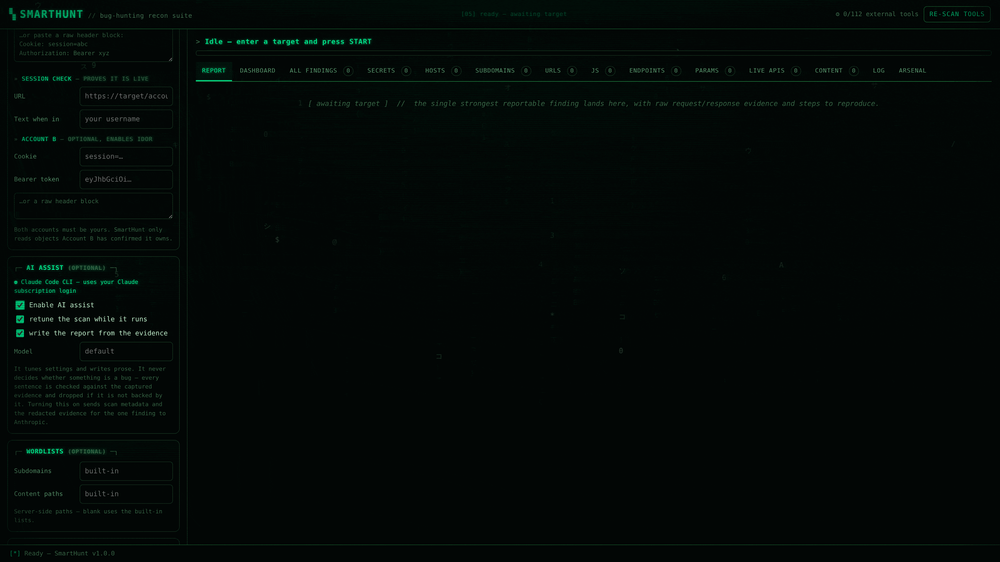

# SmartHunt

**A bug bounty tool that gives you one bug you can actually report.**

Most scanners hand you a list of 40 "issues" and leave you to work out which
ones are real. SmartHunt does the opposite. It hunts, checks its own work, throws
away everything it cannot prove, and gives you **one finding with proof** — the
exact requests it sent, the exact answers it got back, and the steps to repeat
it.

You give it a website. It does the rest.


<sub>A real scan, recorded live: each step turns green as it finishes, the
counters climb, and the finished report appears at the end.</sub>

It comes in three forms, all doing the same thing:

- a **desktop app**
- a **web page** you open in your browser
- a **command line** version for servers

There is also an optional **AI helper** that adjusts the scan while it runs and
writes the report for you. It works with the Claude plan you already pay for.
[Jump to that section →](#ai-helper-optional)

---

## Setup

New to this? Do these five steps. It takes about two minutes.

### 1. Check you have Python

```bash
python3 --version
```

If it prints `Python 3.9` or higher, you're good. If the command isn't found,
get Python from [python.org/downloads](https://www.python.org/downloads/) — on
Windows, tick **"Add Python to PATH"** during install — then close and reopen
your terminal.

> On Windows, type `python` instead of `python3` in every command below.

### 2. Download SmartHunt

```bash
git clone https://github.com/Amansinghtomar12/SmartHunt
cd SmartHunt
```

Don't have `git`? Click the green **Code** button at the top of this page →
**Download ZIP**, unzip it, then open a terminal in that folder.

### 3. Install the one thing it needs

```bash
pip install -r requirements.txt
```

That's it — one package called `requests`. Nothing else.

<details>
<summary>Better way: install it in its own little box (virtual environment)</summary>

This keeps SmartHunt separate from the rest of your system. Some Linux systems
insist on it and will refuse a plain `pip install`.

```bash
python3 -m venv .venv
source .venv/bin/activate          # Windows: .venv\Scripts\activate
pip install -r requirements.txt
```

Run the `activate` line again each time you open a new terminal.
</details>

### 4. Open it

Pick whichever you like — all three run exactly the same scan.

```bash
python3 smarthunt.py --web       # browser version → open http://127.0.0.1:8777
python3 smarthunt.py             # desktop app
python3 smarthunt.py --cli example.com
```

**Not sure? Use `--web`.** It works on every computer, needs nothing extra, and
you drive it from your browser.

### 5. Run your first scan

1. Type a website you own or are allowed to test — for example `example.com`
2. Press **START**
3. Tick the box confirming you're allowed to test it
4. When it finishes, open the **Report** tab

Everything is also saved into a `smarthunt-results/` folder next to the project.

---

## If something goes wrong

| What you see | What to do |
|---|---|
| `No module named 'requests'` | You skipped step 3 — or you're in a different terminal from the one where you ran it. Run `pip install -r requirements.txt` again. |
| `error: externally-managed-environment` | Your Linux blocks system-wide installs. Use the virtual environment box in step 3. |
| `Tkinter is not installed` | Only affects the desktop app. Use `--web` instead, or install it: `sudo apt install python3-tk` (Ubuntu/Debian), `sudo dnf install python3-tkinter` (Fedora), `brew install python-tk` (Mac). |
| `Address already in use` | Something else is using port 8777. Pick another: `python3 smarthunt.py --web --port 9000`. |
| `python3: command not found` | Try `python`. On Windows that's the normal name. |
| Browser page is blank | The terminal running the server must stay open. And use the exact address it printed. |
| `0/112 external tools found` | **This is fine.** SmartHunt has its own built-in version of every step. Extra tools are optional. |
| Scan finds nothing | Check the site is online, and that you typed it without `https://`. |

Still stuck? Run `python3 smarthunt.py --tools`. If that prints a list, your
install is fine and the problem is the target or your network.

---

## Optional: add more tools

**You don't need any of this.** SmartHunt has its own built-in version of every
step, so a fresh download works straight away.

It can also find and use **112 well-known hacking tools** if you have them
installed, and gets faster and deeper with each one.

```bash
./install-tools.sh             # installs what it can, skips what it can't
python3 smarthunt.py --tools   # shows which ones it found
```

Don't install all 112. Just `subfinder`, `httpx`, `katana` and `nuclei` already
make a big difference.

---

## Two ways to give it a target

| You type | What happens |
|---|---|
| `example.com` | **One website, in depth.** Crawls it, downloads every JavaScript file, digs through them for hidden addresses, passwords and settings, then tests what it found. |
| `*.example.com` | **The whole company.** First finds every sub-site (`mail.example.com`, `api.example.com`, `staging.example.com`…), then runs that same deep scan on every one that's alive. |

Typing the `*.` version switches it automatically. You don't have to press
anything.

---

## One bug, and only if it's proven

Here's the part that makes SmartHunt different.

At the end of every scan it looks at everything it found and asks one question
about each: **can I prove this?** Then it gives you exactly one of three answers.


| Answer | When you get it | What you get |
|---|---|---|
| **Report** | It has proof and the bug happens again when re-tested | One finding, with the raw requests and answers, `curl` commands to repeat it, and how to fix it |
| **Evidence needed** | Something looks wrong but a piece of proof is missing | A short list of exactly what's still missing — never a half-finished report |
| **Nothing reportable** | Nothing passed the check | "No reportable vulnerability found with the current evidence." |

Two rules do most of the work.

**Some things are never a bug on their own.** Missing security headers, a version
number showing, a public API doc page, a directory listing — SmartHunt finds
them, but it won't report them, because a bug bounty program will just close the
ticket. Each one is dropped with the reason written in the log, so you can see
the decision instead of wondering where it went.

**Severity comes from what was proved, not from the scary name.** If SmartHunt
proves a database error but never pulls data out, it grades that High, not
Critical — and says why. Before writing anything it re-tests the bug twice, tries
again on a completely fresh session, and blanks out any passwords or keys
(`DB_PASSWORD=REDACTED_SECRET`) so you can paste the report anywhere safely.

The full list of everything it saw is still saved to JSON and CSV. It's just not
the headline.

> **About false positives.** No tool can promise zero, and any tool that promises
> zero is lying to you. SmartHunt is built to **fail quietly rather than guess**:
> it drops anything it can't prove, checks whether the "private" data was public
> all along, repeats the test before believing it, and will happily tell you it
> found nothing.

---

## AI helper (optional)

Switch it on and Claude helps with two things during a scan. It is **off by
default**, and it **never decides whether something is a bug**.



**1. It adjusts the scan while it's running.**
On a big company-wide scan, nobody knows the right settings before they see the
site. So at three points — after the first look around, after reading the
JavaScript, and between deep rounds — Claude reads the scan's own numbers and
changes the settings. A real example from a test run:

```
▶ AI assist — reviewing progress (reconnaissance complete)
  Reconnaissance reports completion but found zero URLs, JS files, endpoints
  and parameters despite one confirmed live host […] this points to a
  discovery gap rather than a genuinely thin target given the Apache/PHP stack.
  adjusted crawl_depth: 1 → 2
  adjusted exhaustive: False → True
  adjusted max_rounds: 4 → 6
  queued 6 extra path(s) for content discovery
```

**2. It writes the report.**
Instead of a fill-in-the-blanks template, you get a proper write-up about *your*
bug: what the attacker did, what came back, and what the site should have done
instead. Same proof, written the way a bug bounty reviewer wants to read it.

### The AI is kept on a very short leash

This is the important bit. The proof check runs **first and alone**. Claude only
ever sees a bug that has already passed it, and can only put it into words.

| Rule | What it means |
|---|---|
| **It runs last** | It cannot invent a bug, upgrade "evidence needed" into a report, or argue with "nothing found" |
| **It only writes the words** | The raw requests, the answers, the `curl` commands and the severity are all produced by the tool itself. Claude fills in text boxes — it never touches the proof |
| **One step per request** | The steps must match the requests that were actually sent, so it can't add a request that never happened |
| **Every sentence is checked** | Wishy-washy words (`may`, `could`, `possibly`, `appears`), scary claims that weren't proved (`RCE`, `account takeover`), a web address that isn't in the proof, an error code that never happened, or a changed severity → **the whole thing is thrown away** and the tool's own report is used instead |
| **Only 8 settings** | It can suggest settings, not conclusions. Only eight are accepted, each limited to what the sliders already allow. It cannot touch the target, your permission checkbox, or the proof check |
| **It cannot leave your scope** | A sub-site it suggests is ignored unless it belongs to the domain you're allowed to test |
| **It has a budget** | A hard limit on how many times it can be called per scan (8 by default), with one call always held back so the report still gets written on a long run |

When it oversteps, the log tells you exactly what it tried:

```
▶ AI assist — writing the report
  AI report rejected — using the verified template instead:
    · speculative language: 'could'
    · impact claim beyond the evidence: 'remote code execution'
```

That's the whole idea. Putting an AI inside a security tool must not add a
single unproven sentence — so this one fails safe. No AI installed, a refused
request, a broken reply, a report that overreaches: every one of those quietly
falls back to the normal report, and your scan is unaffected.

### Does it use my Claude plan?

Yes — through the **Claude Code** app, which logs in with your normal Claude
account (Pro or Max). No API key, no second bill.

| | What you need | Who pays |
|---|---|---|
| **Claude Code** (easiest) | `claude` installed and logged in | Your **Claude subscription** — the plan you already have |
| **Anthropic API** | `pip install anthropic` and an API key (or `ant auth login`) | Billed separately as API usage |

A Max plan is a *subscription*, not API credit — they're two different things.
The Claude Code route is what lets SmartHunt run on the plan you already pay for.
**If you can type `claude` in a terminal, SmartHunt can use it.**

Check what it found:

```bash
python3 smarthunt.py --tools
```

```
AI assist
  ● Claude Code CLI — uses your Claude subscription login
  enable with --ai (off by default)
```

A green `●` means you're set. Then:

```bash
python3 smarthunt.py --cli example.com --ai                  # adjust + write
python3 smarthunt.py --cli example.com --ai --no-ai-tuning   # only write the report
```

In the desktop app and the browser it's the **AI assist** box in the left
sidebar, with the detected account shown above the switch.

**What leaves your computer when it's on:** the scan's numbers (site names,
technologies, counts, current settings), and — only for the single bug it
reports — the proof, with passwords and keys already blanked out. Nothing is
sent when the switch is off, and off is the default.

---

## Logging in (testing as a real user)

Scanning without logging in only ever sees the front door. Give SmartHunt a
session you already have, and every step runs as a logged-in user.

```bash
python3 smarthunt.py --cli target.com \
  --auth-cookie "session=abc123; csrftoken=xyz" \
  --auth-check-url https://target.com/account --auth-check-text "your-username"
```

A "session" can be a cookie, a token, or **a block of headers copied straight
out of Burp or your browser's developer tools** — SmartHunt cleans it up for you.

**It checks the session is alive before trusting it.** An expired cookie doesn't
announce itself: the site just shows the login page, and every "finding" after
that is really about the login page. Give it a page that needs login and a word
that only appears when you're logged in, and it tells you straight away.

### Two accounts = a proven access bug

Give it **a second account you also own** and SmartHunt can prove the most
common serious bug there is: reading someone else's data.

```bash
python3 smarthunt.py --cli target.com \
  --auth-cookie   "session=ACCOUNT_A" \
  --victim-cookie "session=ACCOUNT_B" \
  --auth-check-url https://target.com/account --auth-check-text "account-a-name"
```

For every address that looks like it points at one specific record, it sends
three requests as three different people:

1. **Account B** asks for its own record and gets it — so the record exists and belongs to B.
2. **Nobody** (logged out) asks for the same thing and is refused — so it isn't just public. This is the number one false alarm, killed right here.
3. **Account A** — a different logged-in user — asks for it and gets B's data anyway.

All three must happen. If the logged-out request succeeds, the data was public
and nothing is reported. If Account A gets refused, or just gets its own data,
nothing is reported. It even asks for a different record ID to make sure the page
isn't simply ignoring the number and showing everyone the same thing.

**Both accounts must be yours.** SmartHunt only reads records Account B has
already confirmed it owns, and never writes or deletes anything.

---

## What it actually tests

There's a standard list of the ten most common web security problems, called the
OWASP Top 10. SmartHunt has a dedicated step for all ten. Every test is
**safe** — it only looks, never writes, deletes or breaks anything.

| | Problem | What SmartHunt checks |
|---|---|---|
| A01 | Reading other people's data | **Two-account access test**, path traversal, open redirects |
| A02 | Leaked secrets | Passwords and API keys left inside JavaScript files |
| A03 | Injection | SQL injection (5 database types), reflected XSS, template injection, CRLF |
| A04 | Bad design | Rate-limit and workflow checks |
| A05 | Misconfiguration | CORS holes, dangerous HTTP methods, exposed `.env` / `.git` / admin endpoints |
| A06 | Old software | Version numbers matched against known published bugs |
| A07 | Login problems | Exposed tokens, weak session settings |
| A08 | Untrusted scripts | Third-party JavaScript loaded without integrity checks |
| A09 | Logging problems | Error pages leaking internal details |
| A10 | Server-side request forgery | Settings that take a URL; add `--collaborator` to prove it |

Two of them are honest about their limits: **SSRF** can't be proved without a
server of yours to catch the callback, and **A09** can't be seen from outside.
Both are noted as "worth checking" rather than dressed up as findings.

```bash
python3 smarthunt.py --cli example.com --collaborator abc123.oast.fun
```

---

## Old software with known bugs

Every version number SmartHunt spots gets matched against a list of famous,
publicly known bugs — Apache path traversal, Ghostcat, Spring4Shell, ProxyShell,
Drupalgeddon, Heartbleed, old jQuery, and more. Add `--cve-online` to also check
the public OSV and NVD databases.

**These are never reported as findings, on purpose.** A version number proves
nothing: it can be faked, Linux distributions fix bugs without changing the
number, and the broken code might not even be reachable. So each match is marked
as a *lead*, not a finding, and the proof check refuses it. What you get instead
is the one safe test that settles it:

```
[critical] target.com: CVE-2021-41773 — Apache path traversal (2.4.49)
           NOT verified — GET /cgi-bin/.%2e/%2e%2e/etc/passwd confirms it
```

---

## Wildcard mode goes deep, not just wide

Finding sub-sites is the easy half. Most tools stop there. In wildcard mode
SmartHunt runs the **entire** deep scan against every sub-site that's alive —
downloading each one's JavaScript, digging out the addresses hidden inside, and
then **testing those addresses on every sub-site**.

That last step is the useful one. Reading a JavaScript file gives you text like
`/api/v2/billing` — that's a guess until something answers it. SmartHunt tries
every address it found on every live sub-site, because a staging server very
often exposes an API that the main site keeps hidden. Whatever answers is the
real attack surface, and it feeds straight into the security tests.

---

## Exhaustive mode — leave nothing behind

```bash
python3 smarthunt.py --cli '*.example.com' --exhaustive     # or just -E
python3 smarthunt.py --cli example.com -E --rounds 6
```

A normal scan has limits so it finishes quickly. `--exhaustive` raises those
limits and turns the search into a **loop that keeps going until a round finds
nothing new**.

Each round feeds the next. A sub-site found by guessing hosts JavaScript that
names a second sub-site, whose JavaScript names an API on a third. One pass stops
at the first hop; this doesn't.

```
▶ Exhaustive round 2/3
  round 2: hosts 1->53, URLs 170->814, live 1->52
▶ Exhaustive round 3/3
  round 3: hosts 53->53, URLs 814->814, live 52->52
  converged after 3 rounds — nothing new to find
```

The limits go *up*, not away, and `--rounds` caps the loop — because a search
with no end never finishes, which is not the same thing as thorough.

**It checks for fake sub-sites first.** Many companies answer *every* possible
name, so guessing would otherwise "find" thousands of sub-sites that don't
exist. SmartHunt asks for names nobody would ever register, learns what a fake
answer looks like, and throws away any guess that matches it.

---

## The arsenal — 112 tools, all driven for you


When tools find *different* things, SmartHunt runs them all and merges the
results: every sub-site finder, every JavaScript analyser, every secret scanner,
every content fuzzer.

When tools do the *same* job — port scanners, DNS lookups — it picks the best one
you have installed, because running three tools to do one job is just three times
the traffic. `sqlmap` is the exception: it only runs against a spot where a
database error has *already* been captured, turning a proven bug into a confirmed
one instead of hammering the whole site.

The categories: sub-site discovery, DNS, HTTP checking, port scanning, OSINT,
crawling, JavaScript analysis, parameter discovery, content discovery, APIs and
GraphQL, vulnerability scanning, injection testing, takeover, cloud storage, TLS,
CMS scanning, out-of-band, screenshots and secret scanning.

Adding a new tool is one line in `smarthunt/extra_tools.py`.

---

## The desktop app and the browser look the same

Both run the same engine and have the same features — a green-on-black terminal
look with falling matrix rain, a boot-up sequence, counters that count up, a
spinner on whatever step is running, and a glitch when a finding lands. All the
motion turns itself off if your system asks for reduced motion.


<sub>The desktop app running the same scan.</sub>

The browser version uses Python's own built-in web server, so it needs nothing
extra installed. Because it lives at an address any web page could try to reach,
it protects itself three ways: it only accepts `localhost` addresses, every
action needs a secret token that only its own page is given, and requests coming
from other websites are rejected outright. Without that, any site you happened to
have open could quietly start scans from your computer.

Running it on a remote server? Don't open the port to the internet — tunnel it:

```bash
ssh -L 8777:127.0.0.1:8777 you@your-server    # then open http://127.0.0.1:8777
```

---

## What happens, step by step

| # | Step | What it does |
|---|---|---|
| 1 | Sub-site discovery | Every public source and installed tool, plus name guessing (wildcard mode) |
| 2 | DNS lookup | Turns names into IP addresses; spots fake wildcard answers |
| 3 | Port scanning | Common ports, or your own list |
| 4 | HTTP check | Finds which sites are actually alive |
| 5 | Technology detection | Works out what software is running |
| 6 | Takeover check | Looks for sub-sites pointing at services nobody owns any more |
| 7 | Address collection | Web archives, crawlers, and its own built-in crawler |
| 8 | JavaScript analysis | Downloads every JS file; digs out addresses, settings and secrets |
| 9 | Endpoint verification | Tries those addresses on every live site; keeps the ones that answer |
| 10 | Parameter discovery | Finds the input fields a site accepts |
| 11 | Content discovery | Looks for hidden files and folders |
| 12 | Vulnerability checks | Exposed files, headers, transport, nuclei |
| 13 | OWASP Top 10 | Safe active tests across all ten categories |
| 14 | Known-bug matching | Old versions flagged for you to confirm by hand |
| 15 | Access control | Account A vs Account B (needs two logins) |
| 16 | Screenshots | Pictures of every live site |
| — | **Proof check** | Throws out everything unproven → one report |

---

## What you get at the end

```
smarthunt-results/example_com/
├── example_com-REPORT.md     # the one bug — this is what you submit
├── example_com.json          # everything it saw
├── example_com.html          # a report you can open in a browser
├── example_com.md            # full summary
├── example_com-findings.csv  # open in Excel
└── lists/
    ├── subdomains.txt  live-hosts.txt  urls.txt
    ├── js-files.txt    endpoints.txt   parameters.txt
```

---

## All the options

```bash
python3 smarthunt.py --help
```

| Command | What it does |
|---|---|
| `--web` / `--port` / `--open` | Browser version |
| `--cli` / `-y` | Terminal version, skip the confirmation prompt |
| `--ai` | Turn on the AI helper |
| `--ai-model` / `--ai-budget` | Choose the model, and how many AI calls per scan |
| `--no-ai-tuning` / `--no-ai-report` | Use only half of the AI helper |
| `--exhaustive` / `-E` / `--rounds` | Keep searching until nothing new turns up |
| `--auth-cookie` / `--auth-bearer` / `--auth-headers` | Log in as Account A |
| `--auth-check-url` / `--auth-check-text` | Prove the login actually works |
| `--victim-cookie` / `--victim-bearer` / `--victim-headers` | Account B — enables the access-control test |
| `--collaborator` | Your own server, to catch SSRF callbacks |
| `--cve-online` | Also check the public bug databases |
| `--no-sqlmap` | Don't run sqlmap even on a proven injection |
| `--threads` / `--depth` / `--max-pages` / `--max-js` | Speed and depth |
| `--stages` / `--all` | Choose exactly which steps run |
| `--sub-wordlist` / `--content-wordlist` | Use your own word lists |
| `--tools` | Show which of the 112 tools — and which AI — were found |

---

## Please read this part

SmartHunt sends **real traffic to real websites**. Both apps make you tick a box
first, and the terminal version needs `-y`.

**Only scan websites you own, or have written permission to test** — an in-scope
bug bounty program, a client who has signed a contract, or your own servers.
Check the program's rules before using the login or AI features; some programs
restrict automated testing, and logging in makes the traffic traceable to your
account.

The two-account test needs **two accounts you control**. It only ever reads
records that Account B has confirmed it owns, and never touches anyone else's
data.

---

## Requirements

- Python 3.9 or newer
- `requests` — the only thing you must install
- Tkinter, for the desktop app only — `--web` and `--cli` work without it
- Claude Code, only if you want the AI helper — optional
- Any of the 112 external tools you feel like installing — all optional
