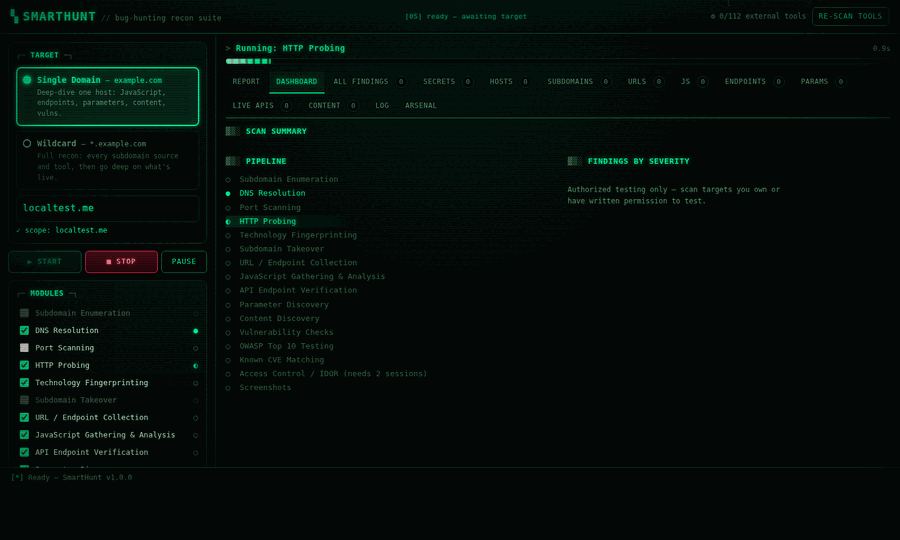
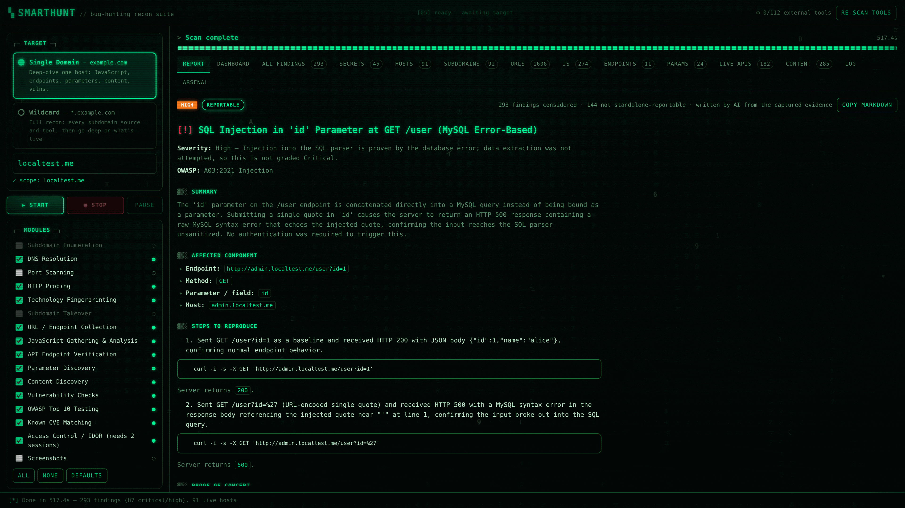
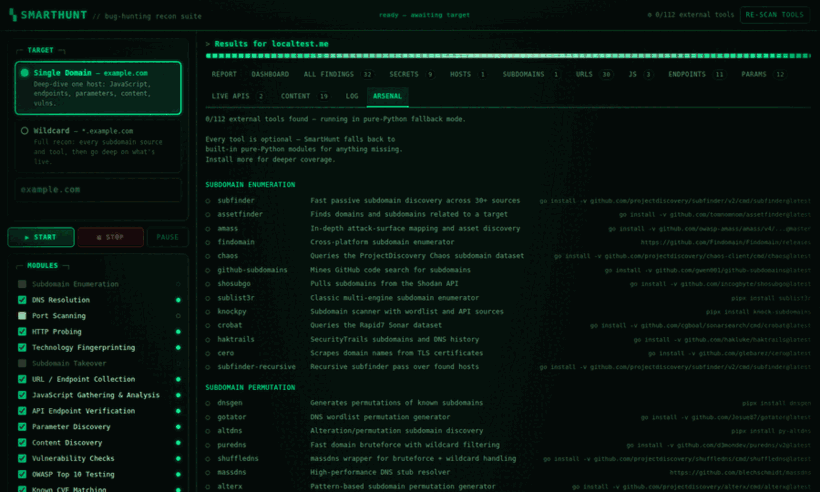
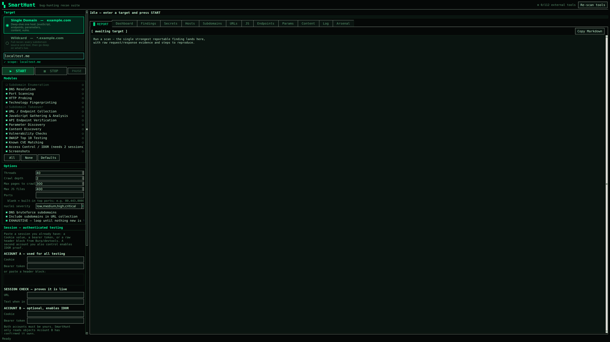

# SmartHunt

A bug-hunting recon suite that ends in **one proven, reportable finding** — not a
list of 30 things you still have to triage yourself.

Point it at a domain or a wildcard, press START, and it runs the full pipeline:
subdomain enumeration, HTTP probing, JavaScript mining, endpoint verification,
content discovery, the OWASP Top 10, known-CVE matching, and — given two
accounts you control — broken access control. Then it applies an evidence gate
to everything it found and writes up the single strongest one, with raw
request/response proof and `curl` reproduction steps.

Desktop app, browser UI, and headless CLI, all over the same engine. Optionally,
Claude tunes the scan as it runs and writes the report from the captured
evidence — [fenced so it can never invent a finding](#ai-assist--optional-and-fenced-in).



<sub>A real scan, recorded live: stages turning green as they complete, the
elapsed clock advancing, counters climbing, then the triaged report.</sub>

---

## Setup

New to this? Follow these five steps exactly — they take about two minutes.

### 1. Check you have Python 3.9 or newer

```bash
python3 --version
```

If that prints `Python 3.9` or higher, you're fine. If the command isn't found,
install Python from [python.org/downloads](https://www.python.org/downloads/)
(tick **"Add Python to PATH"** on Windows), then reopen your terminal.

> On Windows, use `python` instead of `python3` in every command below.

### 2. Download SmartHunt

```bash
git clone https://github.com/Amansinghtomar12/SmartHunt
cd SmartHunt
```

No `git`? Click the green **Code** button at the top of this page →
**Download ZIP**, unzip it, then `cd` into the folder.

### 3. Install the one dependency

```bash
pip install -r requirements.txt
```

That installs `requests`. Nothing else is required.

<details>
<summary>Recommended: install into a virtual environment instead</summary>

Keeps SmartHunt's dependency out of your system Python. Some Linux distros
require this and will refuse a plain `pip install`.

```bash
python3 -m venv .venv
source .venv/bin/activate          # Windows: .venv\Scripts\activate
pip install -r requirements.txt
```

Run `source .venv/bin/activate` each time you open a new terminal.
</details>

### 4. Start it

Pick whichever you prefer — all three run the same engine.

```bash
python3 smarthunt.py --web       # browser UI, then open http://127.0.0.1:8777
python3 smarthunt.py             # desktop app
python3 smarthunt.py --cli example.com
```

**If you're not sure, use `--web`.** It works everywhere, needs nothing extra,
and you drive it from your browser.

### 5. Run your first scan

1. Type a domain you own or are authorised to test — e.g. `example.com`
2. Press **START**
3. Confirm the authorization prompt
4. When it finishes, read the **Report** tab

Results are also written to `smarthunt-results/` next to the project folder.

---

## Troubleshooting

| Message | What to do |
|---|---|
| `ModuleNotFoundError: No module named 'requests'` | You skipped step 3, or you're in a different terminal than the one where you activated the venv. Re-run `pip install -r requirements.txt`. |
| `error: externally-managed-environment` | Your distro blocks system-wide pip. Use the virtual environment shown in step 3. |
| `Tkinter is not installed` | Only affects the desktop app. Either use `--web` instead, or install it: `sudo apt install python3-tk` (Debian/Ubuntu), `sudo dnf install python3-tkinter` (Fedora), `brew install python-tk` (macOS). |
| `Address already in use` | Something else is on port 8777. Use another: `python3 smarthunt.py --web --port 9000`. |
| `python3: command not found` | Try `python`. On Windows that's the normal name. |
| Browser shows nothing at 127.0.0.1:8777 | Check the terminal is still running the server — it must stay open. Don't use `localhost:` with a different port than the one printed. |
| `0/112 external tools found` | Expected and fine. Every stage has a pure-Python fallback. Install optional tools later with `./install-tools.sh`. |
| Scan finds nothing | Confirm the domain resolves and is reachable, and that you typed it without `https://`. |

Still stuck? Run `python3 smarthunt.py --tools` — if that prints a tool list,
your install is working and the problem is with the target or the network.

---

## Optional: more tools, deeper results

**Nothing below is required.** SmartHunt ships a pure-Python implementation of
every stage, so a fresh clone produces real results with zero setup. It also
detects and drives **112 optional tools across 20 categories**, and gets faster
and deeper with each one you install.

```bash
./install-tools.sh          # installs what it can; skips what it can't
python3 smarthunt.py --tools   # shows which ones were found
```

Most need Go, Python or Rust already present. Install a handful you care about
rather than all 112 — `subfinder`, `httpx`, `katana` and `nuclei` alone make a
large difference.

---

## Two target modes

| Mode | Input | What it does |
|---|---|---|
| **Single Domain** | `example.com` | Deep-dive one host: crawl it, pull every JavaScript file, mine those files for endpoints, parameters and secrets, verify which endpoints are real, then test what it found. |
| **Wildcard** | `*.example.com` | Go wide first — every subdomain source and tool available — then run the *entire* deep-dive against everything that came back alive. |

Typing `*.example.com` switches to wildcard mode automatically.

---

## One reportable bug, not a wall of noise

Every scan ends in a triage stage that applies an evidence gate to the whole
finding set and produces exactly one of three outcomes.



| Outcome | When | What you get |
|---|---|---|
| **Report** | Every evidence field is filled and the behaviour reproduces | One finding, severity graded from proven impact, raw request/response, numbered `curl` steps, remediation |
| **Evidence needed** | Something looks real but a proof is missing | The exact tests still owed — never a half-written report |
| **Nothing reportable** | No candidate clears the gate | "No reportable vulnerability found with the current evidence." |

Two rules do the heavy lifting.

**A large class of scanner output is never a standalone report.** Missing
headers, version banners, `x-powered-by`, exposed Swagger, wildcard CORS,
directory listings, SSRF candidates without a collaborator callback, endpoint
discovery — all filtered, each with its reason logged so you can see the call
being made rather than wondering where a finding went.

**Severity comes from what was proven, not from the bug class.** Error-based SQL
injection proves injection, not data exfiltration, so it grades High rather than
Critical and the report says exactly why. The winner is re-verified at report
time — reproduced twice, retried on a fresh cookie-free session — and
credentials are masked (`DB_PASSWORD=REDACTED_SECRET`) before anything is
written to disk.

The full finding list still exports to JSON and CSV for your own digging. It
just isn't the headline.

> **On false positives.** No tool can promise zero, and one that claims to is
> lying. SmartHunt is built to fail *closed*: it drops what it cannot prove,
> checks the unauthenticated case to kill the "this was public all along"
> mistake, reproduces before reporting, and says "nothing reportable" rather
> than padding the output.

---

## AI assist — optional, and fenced in

Turn it on and Claude does two jobs during a scan. It does **not** get a vote on
whether something is a bug.

**It retunes the scan while it runs.** On a big wildcard scope the right crawl
depth, page cap and round count are impossible to guess before you have seen the
surface. At three checkpoints — after reconnaissance, after the JavaScript has
been mined, and between exhaustive rounds — it reads the scan's own numbers and
adjusts. It can also queue extra paths worth requesting and name in-scope hosts
worth probing.

**It writes the report.** Instead of the fixed template, you get prose about
*your* finding: what the attacker did, what came back, what the endpoint should
have done. Same evidence, written the way a triager wants to read it.

### What it is not allowed to do

The evidence gate runs first and decides alone. The AI is only ever handed a
finding that has already passed it, and can only rephrase what is there:

| Fence | Effect |
|---|---|
| **Runs after triage** | It cannot create a finding, promote "evidence needed" to reportable, or overturn "nothing found" |
| **Prose slots only** | Raw requests, responses, `curl` steps and the severity line are rendered by code. It fills named text fields — it never touches the proof |
| **One step per exchange** | The reproduction steps must match the captured exchanges exactly, so it cannot invent a request that was never sent |
| **Every sentence checked** | Hedging (`may`, `could`, `potentially`, `appears`), unproven escalation (`RCE`, `account takeover`, `exfiltration`), a URL that is not in the evidence, a status code that was never returned, or a restated severity → **the whole rewrite is discarded** and the verified template is used |
| **Whitelisted settings** | It returns settings, not conclusions. Only eight are honoured, each clamped to the range the UI already allows. It cannot reach the target, the authorization flag, the output path or the evidence gate |
| **Scope-locked** | A suggested hostname is dropped unless it sits inside the authorised apex. No amount of model creativity pushes a scan out of your program |
| **Budgeted** | Hard cap on model calls per scan (default 8) |

When a rewrite is rejected the log says exactly why, line by line — you see the
call being made:

```
▶ AI assist — writing the report
  AI report rejected — using the verified template instead:
    · speculative language: 'could'
    · impact claim beyond the evidence: 'remote code execution'
```

That is the whole design. Adding a language model to a security tool must not
add a single unproven claim, so this one fails closed: no provider, a refused
request, a malformed reply, a rewrite that overreaches — every one of those ends
with the deterministic report, and the scan is unaffected.

### Which Claude does it use?

Detected automatically, in this order:

| | Requirement | Billing |
|---|---|---|
| **Claude Code CLI** | `claude` on your PATH and logged in | Your **Claude subscription** (Pro/Max) — no API key |
| **Anthropic SDK** | `pip install anthropic` + credentials (`ANTHROPIC_API_KEY`, `ANTHROPIC_AUTH_TOKEN`, or `ant auth login`) | Anthropic API, billed separately from a subscription |

A Max plan is a *subscription*, not API credit — the two bill separately. The
CLI route is what lets SmartHunt run on the plan you already pay for: if you can
run `claude` in a terminal, SmartHunt can use it.

```bash
python smarthunt.py --tools                     # shows which provider was found
python smarthunt.py --cli example.com --ai      # tune the scan + write the report
python smarthunt.py --cli example.com --ai --no-ai-tuning   # report only
```

In the desktop app and the browser UI it is the **AI assist** panel in the
sidebar, with the detected provider shown above the switch.

**What leaves your machine when it is on:** scan metadata (host names,
technologies, counts, current settings) at each checkpoint, and — for the single
triaged finding only — the redacted evidence, with credentials already masked to
placeholders. Nothing is sent when the switch is off, which is the default.

---

## Authenticated testing

Unauthenticated scanning only ever sees the front door. Hand SmartHunt a session
you already have and every stage — crawling, JS collection, content discovery,
the OWASP checks — runs logged in.

```bash
python smarthunt.py --cli target.com \
  --auth-cookie "session=abc123; csrftoken=xyz" \
  --auth-check-url https://target.com/account --auth-check-text "your-username"
```

Sessions can be a `Cookie` value, a bearer token, or a **raw header block pasted
straight from Burp or devtools** — hop-by-hop headers are stripped and `Cookie:`
is split into the jar automatically.

**The session is verified before the scan leans on it.** A stale cookie doesn't
fail loudly: the app serves the login page with HTTP 200 and every finding
afterwards is quietly about that login page. Give a check URL and a string that
only appears when logged in, and SmartHunt says so once, up front.

### Two accounts → proven IDOR

Supply a **second account you also control** and SmartHunt tests OWASP A01,
Broken Access Control — the most common serious bug class, and one no
single-session scanner can prove:

```bash
python smarthunt.py --cli target.com \
  --auth-cookie   "session=ATTACKER_A" \
  --victim-cookie "session=VICTIM_B" \
  --auth-check-url https://target.com/account --auth-check-text "attacker-name"
```

Every candidate endpoint gets three requests under three identities:

1. **Victim B** requests their own object and is served it — so the object exists, is private, and B owns it.
2. An **unauthenticated** client requests the same URL and is refused — so it is not simply public, by far the most common false positive.
3. **Attacker A**, a different logged-in account, requests it and is served B's data anyway.

All three must hold. If the anonymous request succeeds, the resource is public
and nothing is reported. If Attacker A gets 401/403/404, or their own data
rather than B's, nothing is reported. SmartHunt also re-requests with a
different object ID: identical responses mean the endpoint ignores the
identifier and is returning a generic page, not B's record.

**Both accounts must be yours.** SmartHunt only ever reads objects Account B has
itself confirmed it owns, and every request is a read.

---

## OWASP Top 10 coverage

A dedicated stage tests the discovered attack surface across all ten 2021
categories. Every check is **non-destructive** — bounded GET-style probes, no
payload that writes, deletes or degrades the target.

| | Category | What is actually tested |
|---|---|---|
| A01 | Broken Access Control | **IDOR with two sessions**, path traversal, open redirect |
| A02 | Cryptographic Failures | Secrets in JS bundles, transport checks |
| A03 | Injection | SQL injection (5 engines), reflected XSS, SSTI, CRLF |
| A04 | Insecure Design | Rate-limit and workflow probes |
| A05 | Security Misconfiguration | Credentialed CORS reflection, risky methods, exposed `.env` / `.git` / actuator |
| A06 | Vulnerable Components | Version banners matched against known CVEs |
| A07 | Auth Failures | JWT exposure, session attributes |
| A08 | Integrity Failures | Third-party scripts without Subresource Integrity |
| A09 | Logging Failures | Stack traces and verbose errors leaking internals |
| A10 | SSRF | URL-taking parameters; `--collaborator` to prove the callback |

Two categories are honest about their limits: **SSRF** cannot be proven without a
collaborator host you control, and **A09** is not externally observable. Both are
recorded as candidates rather than dressed up as findings.

```bash
python smarthunt.py --cli example.com --collaborator abc123.oast.fun
```

---

## Known-CVE matching

Every fingerprinted banner and library version is matched against a curated
table of high-signal, remotely-checkable CVEs — Apache path traversal, Ghostcat,
Spring4Shell, ProxyShell, Drupalgeddon, Heartbleed, jQuery XSS and prototype
pollution. `--cve-online` additionally queries OSV and NVD.

**These are never reported as findings.** A version banner proves nothing:
banners lie, distributions backport fixes without bumping the string, and the
vulnerable code path may not even be reachable. Every match is labelled
inference, carries low confidence, has an empty impact field, and is refused by
the triage gate. What each one carries instead is the safe check that confirms
or kills it by hand:

```
[critical] target.com: CVE-2021-41773 — Apache path traversal (2.4.49)
           NOT verified — GET /cgi-bin/.%2e/%2e%2e/etc/passwd confirms it
```

---

## Wildcard goes deep on every subdomain

Finding subdomains is the easy half. In wildcard mode SmartHunt runs the *whole*
domain-mode pipeline against everything it found alive — pulling each host's
JavaScript, mining it for endpoints, then **verifying those endpoints host by
host**.

That last step matters. Reading a bundle gives you path strings; `/api/v2/billing`
is a guess until something answers it. SmartHunt joins every mined path onto
every live host and probes it, because staging subdomains routinely expose an
API that production does not. What comes back — with status, content type and
allowed methods — is the real, callable attack surface, and it feeds straight
into the OWASP and access-control stages.

---

## Exhaustive mode — nothing left behind

```bash
python smarthunt.py --cli '*.example.com' --exhaustive     # or -E
python smarthunt.py --cli example.com -E --rounds 6
```

A normal scan has caps that keep it quick. `--exhaustive` raises them and turns
discovery into a **loop that runs until a round finds nothing new**.

Each round's discoveries seed the next. A subdomain found by permutation hosts
JavaScript naming a second subdomain, whose bundle names an API on a third — a
single pass stops at the first hop. Every round re-mines three sources:
hostnames embedded in collected URLs, hostnames referenced inside JavaScript,
and a fresh permutation pass seeded by what *this scan* has actually seen.

```
▶ Exhaustive round 2/3
  round 2: hosts 1->53, URLs 170->814, live 1->52
▶ Exhaustive round 3/3
  round 3: hosts 53->53, URLs 814->814, live 52->52
  converged after 3 rounds — nothing new to find
```

The ceilings go up rather than away, and `--rounds` bounds the loop, because an
unbounded crawl over a large wildcard scope never terminates — which is not the
same thing as thorough.

**Wildcard DNS is detected first.** Many domains answer *every* name, so
bruteforce and permutation would otherwise "find" thousands of hosts that do not
exist — and in exhaustive mode that becomes an endless supply. SmartHunt queries
names nobody would register, learns the wildcard's addresses, and drops any
guessed host that only resolves there. Hosts from passive sources are kept,
because something attested to those.

---

## The arsenal — 112 tools, all driven



Where tools find *different* things, SmartHunt runs them all and merges: every
subdomain source, all permutation generators, both takeover scanners, every JS
analyser (jsluice, LinkFinder, SecretFinder, xnLinkFinder, mantra, trufflehog,
gitleaks), every content fuzzer.

Where tools are interchangeable implementations of the same scan — port
scanners, DNS resolvers — the best available one runs, because three tools
repeating one scan is just three times the traffic. `sqlmap` is the exception
that proves the rule: it only runs against a parameter whose database error has
already been captured, turning a proven injection into a confirmed one instead
of hammering every parameter on the site.

Categories: subdomain enumeration and permutation, DNS, HTTP probing, port
scanning, OSINT/attack surface, crawling, JavaScript analysis, parameter
discovery, content discovery, API & GraphQL, vulnerability scanning, injection
testing, takeover, cloud storage, TLS, CMS scanning, out-of-band, screenshots
and secret scanning.

Adding a tool is one row in `smarthunt/extra_tools.py`.

---

## Interface

Both front-ends share one engine, one palette and one feature set — a phosphor
terminal skin with matrix rain, a boot sequence, count-up readouts, a spinner on
the running stage and a glitch when a finding lands. All motion respects
`prefers-reduced-motion`.



<sub>The desktop app running the same scan — the stage spinner, the counters
easing up, and the report opening when it finishes.</sub>

The browser UI runs on Python's stdlib `http.server`, so it needs no extra
dependency. Because it lives on an origin every page in your browser can reach,
it defends itself on three fronts: `Host` must be a loopback name (blocking DNS
rebinding), every mutating request must carry a per-process `X-SmartHunt-Token`
stamped into the page, and a cross-origin `Origin` is rejected. Without that
token check, any site you happened to be visiting could quietly start scans from
your machine.

On a remote box, don't expose the port — forward it:

```bash
ssh -L 8777:127.0.0.1:8777 you@your-vps    # then browse http://127.0.0.1:8777
```

---

## The pipeline

| # | Stage | What it does |
|---|---|---|
| 1 | Subdomain Enumeration | Every passive source and installed tool, plus DNS bruteforce and permutation (wildcard mode) |
| 2 | DNS Resolution | Resolves hosts to IPs and CNAMEs; detects wildcard DNS |
| 3 | Port Scanning | Top ports or your own list |
| 4 | HTTP Probing | Finds live web services, status, title, server |
| 5 | Technology Fingerprinting | Headers, cookies, body markers |
| 6 | Subdomain Takeover | Dangling CNAMEs against 25+ provider fingerprints |
| 7 | URL / Endpoint Collection | Archives, crawlers, and a built-in crawler |
| 8 | JavaScript Gathering & Analysis | Pulls every JS file; mines endpoints, parameters, secrets |
| 9 | API Endpoint Verification | Probes mined paths against every live host; keeps what answers |
| 10 | Parameter Discovery | Names and values from URLs, tools and the corpus |
| 11 | Content Discovery | Curated paths plus your wordlist |
| 12 | Vulnerability Checks | Exposed files, headers, transport, nuclei |
| 13 | OWASP Top 10 Testing | Active non-destructive checks across all ten categories |
| 14 | Known CVE Matching | Version-inferred CVEs, flagged for manual confirmation |
| 15 | Access Control / IDOR | Attacker A vs Victim B (needs two sessions) |
| 16 | Screenshots | Visual triage of live hosts |
| — | **Triage** | Evidence gate → the single reportable finding |

---

## Results

Every scan exports:

```
smarthunt-results/example_com/
├── example_com-REPORT.md     # the one triaged finding — this is what you submit
├── example_com.json          # everything, including the triaged report
├── example_com.html          # standalone HTML report
├── example_com.md            # full scan summary in Markdown
├── example_com-findings.csv
└── lists/
    ├── subdomains.txt  live-hosts.txt  urls.txt
    ├── js-files.txt    endpoints.txt   parameters.txt
```

---

## Options

```bash
python smarthunt.py --help
```

| Flag | Purpose |
|---|---|
| `--web` / `--port` / `--open` | Browser UI |
| `--cli` / `-y` | Headless, skip the authorization prompt |
| `--exhaustive` / `-E` / `--rounds` | Loop discovery until nothing new appears |
| `--auth-cookie` / `--auth-bearer` / `--auth-headers` | Session for Account A |
| `--auth-check-url` / `--auth-check-text` | Prove the session is live |
| `--victim-cookie` / `--victim-bearer` / `--victim-headers` | Account B, enables IDOR |
| `--ai` | AI assist: retune the scan and write the report |
| `--ai-model` / `--ai-budget` | Model override, and the cap on calls per scan |
| `--no-ai-tuning` / `--no-ai-report` | Use only one half of the assist |
| `--collaborator` | Host that observes SSRF callbacks |
| `--cve-online` | Also query OSV and NVD |
| `--no-sqlmap` | Skip sqlmap confirmation on proven injection points |
| `--threads` / `--depth` / `--max-pages` / `--max-js` | Tuning |
| `--stages` / `--all` | Pick modules explicitly |
| `--sub-wordlist` / `--content-wordlist` | Your own wordlists |
| `--tools` | Show which of the 112 tools were detected |

---

## Authorization

SmartHunt sends real, active traffic. Both UIs require you to confirm
authorization before a scan starts, and the CLI needs `-y`.

**Only scan targets you own or have written permission to test** — an in-scope
bug bounty program, a client engagement with a signed statement of work, or your
own infrastructure. Check the program's rules before running authenticated or
automated testing; some restrict both, and a session makes the traffic
attributable to your account.

The access-control checks require two accounts **you control**. They only read
objects Account B has itself confirmed it owns, and never touch real users' data.

---

## Requirements

- Python 3.9+
- `requests` (the only dependency)
- Tkinter for the desktop app — optional, `--web` and `--cli` work without it
- Any of the 112 external tools you care to install — all optional
